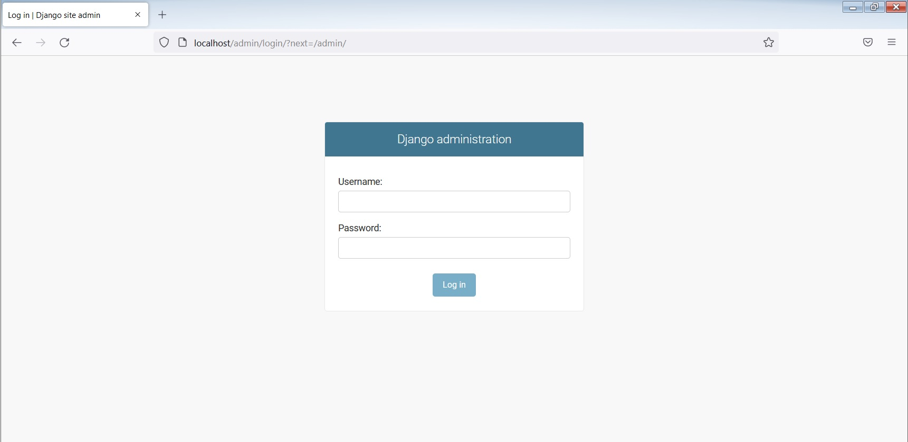
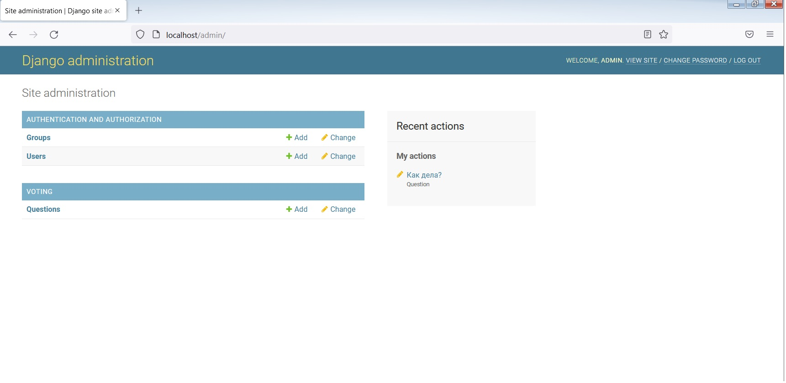
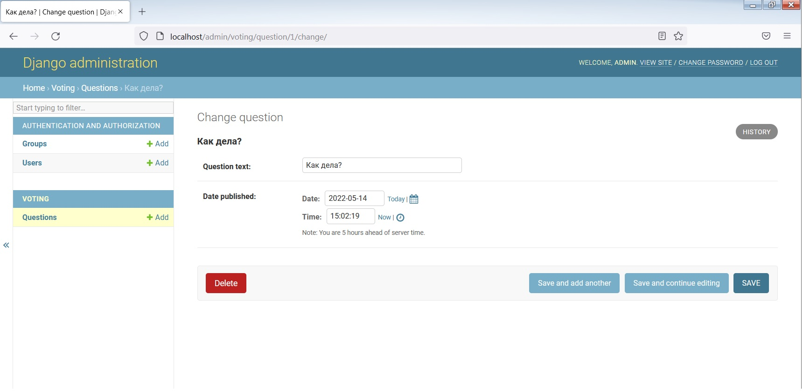

# 💎Django
## 🙈Tech stack
- [x] **Server OS:** Microsoft Windows 7 Enterprise 6.1.7601 SP1 сборка 7601
- [x] **Web application engine:** Python 3.8.9 & Django 4.0.4

## 👽Создание виртуальной среды
> Виртуальная среда - это среда Python, которая создаётся отдельно для проекта и является изолированной. В этой среде есть отдельные версии Python и других зависимостей, например, Django. Благодаря виртуальной среде приложение может запускаться независимо от других. Кроме того, при обновлении или понижении версий Python или библиотек эти изменения не будут затрагивать другие проекты.

Для создания виртуальной среды определим каталог. Затем выполним команду
```
python -m venv test
```
где test - это имя виртуальной среды.

Для активации виртуальной среды запустим скрипт:
```
test\Scripts\activate.bat
```
Деактивация выполняется командой `deactivate`.

В виртуальной среде установим Django.
```
python -m pip install Django
```

## 🌊Создание проекта

Также создадим отдельный каталог под проекты Django. В нём выполним команду
```
django-admin startproject site1
```
где site1 - название проекта.

Данная команда создаёт каталог вида:
> site1/
> 
> &emsp; manage.py
>   
> &emsp; site1/
>   
>  &emsp; &emsp; \_\_init\_\_.py
>     
>  &emsp; &emsp; settings.py
>     
>  &emsp; &emsp; urls.py
>     
>  &emsp; &emsp; asgi.py
>   
>  &emsp; &emsp; wsgi.py

## Создание приложения голосования
> Приложение – это Web-приложение, которое предоставляет определенный функционал – например, Web-блог, хранилище каких-то записей или простое приложение для голосования. Проект – это совокупность приложений и конфигурации сайта. Проект может содержать несколько приложений. Приложение может использоваться несколькими проектами.

Для создания приложения нужно выполнить команду 
```
python manage.py startapp app
```
где app - название приложения.

Команда создаст соответствующий подкаталог рядом с site1/site1

> app/
> 
> &emsp; \_\_init\_\_.py
>   
> &emsp; admin.py
>   
>  &emsp; migrations.py 
>     
>  &emsp; &emsp; \_\_init\_\_.py
>     
> &emsp; models.py
> 
> &emsp; tests.py
> 
> &emsp; views.py

## Первое представление
Создадим первое представление в `app/views.py`
```
from django.http import HttpResponse

def index(request):
    return HttpResponse("Hello, world. You're at the app index.")
```

Чтобы вызвать представление, нам нужно назначить его на какой-то URL - для этого нам нужна конфигурация URL-ов.

В `app/urls.py`:
```
from django.urls import path
from . import views

urlpatterns = [
    path('', views.index, name='index'),
]
```
Следующий шаг – добавить ссылку на app.urls в главной конфигурации URL-ов. В ``site1/urls.py`` добавим импорт django.urls.include, затем include() добавим в список urlpatterns. Вы должны получить следующий код:
```
from django.contrib import admin
from django.urls import include, path

urlpatterns = [
    path('app/', include('app.urls')),
    path('admin/', admin.site1.urls),
]
```
Теперь можно обратиться к приложению по пути `localhost/app`.

## Настройка БД
База данных настраивается в `site1/settings.py`. Для прототипа будет достаточно sqlite (настроена по-умолчанию).

База данных содержит таблицы приложений, а также моделей.
Для создания таблиц нужно выполнить команду
```
python manage.py migrate
```

## Создание моделей
> Модель — это основной источник данных. Она содержит информацию о наборе полей и о поведении данных, которые вы храните.
В нашем приложении голосования, мы создадим две модели: Question и Choice. Question содержит вопрос и дату публикации. Choice содержит два поля: текст ответа и подсчёт голосов. Каждый объект Choice связан с объектом Question.

В `app/models.py`
```
from django.db import models


class Question(models.Model):
    question_text = models.CharField(max_length=200)
    pub_date = models.DateTimeField('date published')


class Choice(models.Model):
    question = models.ForeignKey(Question, on_delete=models.CASCADE)
    choice_text = models.CharField(max_length=200)
    votes = models.IntegerField(default=0)
```

## Активация моделей
Как было отмечено выше, с помощью миграций создаются таблицы в БД для моделей. Кроме того, создаётся Python API для доступа к моделям через веб-интерфейс.

Добавим приложение к проекту в `site1/settings.py`:
```
INSTALLED_APPS = [
    'app.apps.AppConfig',
    'django.contrib.admin',
    'django.contrib.auth',
    'django.contrib.contenttypes',
    'django.contrib.sessions',
    'django.contrib.messages',
    'django.contrib.staticfiles',
]
```

Выполняя `makemigrations`, вы говорите Django, что внесли некоторые изменения в ваши модели (в нашем случае мы создали несколько новых) и хотели бы сохранить их в миграции:
```
python manage.py makemigrations app
```

Если необходимо, можно выполнить `python manage.py check`. Эта команда ищет проблемы в вашем проекте не применяя миграции и не изменяя базу данных.

Теперь, выполните команду `migrate` снова, чтобы создать таблицы для этих моделей в базе данных:
```
python manage.py migrate
```
> Миграции — очень мощная штука. Они позволяют изменять ваши модели в процессе развития проекта без необходимости пересоздавать таблицы в базе данных. Их задача изменять базу данных без потери данных.
> 
> Алгоритм работы с миграциями:
> 1. Внесите изменения в модели (в `models.py`).
> 2. Выполните python manage.py makemigrations чтобы создать миграцию для ваших изменений.
> 3. Выполните python manage.py migrate чтобы применить изменения к базе данных.

## Создание вопроса и ответов через API
Чтобы запустить консоль Python выполните:
```
python manage.py shell
```

> Мы используем эту команду вместо просто «python», потому что manage.py устанавливает переменную окружения `DJANGO_SETTINGS_MODULE`, которая указывает Django путь импорта для файла `site1/settings.py`.

```
from app.models import Choice, Question
from django.utils import timezone
q = Question(question_text="Как дела?", pub_date=timezone.now())
q.save()
#отображает все объекты
Question.objects.all()
#<QuerySet [<Question: Question object (1)>]>
```
Для того, чтобы объекты отображались в понятном виде в `app/models.py` добавим методы:
```
from django.db import models

class Question(models.Model):
    # ...
    def __str__(self):
        return self.question_text

class Choice(models.Model):
    # ...
    def __str__(self):
        return self.choice_text
```
Также добавим пользовательский метод:
```
import datetime
from django.db import models
from django.utils import timezone

class Question(models.Model):
    # ...
    def was_published_recently(self):
        return self.pub_date >= timezone.now() - datetime.timedelta(days=1)
```

Теперь в `python manage.py shell`:
```
from app.models import Choice, Question
from django.utils import timezone
Question.objects.all()
#<QuerySet [<Question: Как дела?>]>
q = Question.objects.get(pk=1)
q.was_published_recently()
#True
q.choice_set.create(choice_text='Норм', votes=0)
q.choice_set.create(choice_text='Не норм', votes=0)
```

## Интерфейс администратора
Создадим суперпользователя:
```
python manage.py createsuperuser
#Username: admin
#Email address: admin@example.com
#Password: **********
#Password (again): *********
#Superuser created successfully.
```

Чтобы обратиться к интерфейсу администратора нужно перейти в приложение `localhost/admin/`:


Чтобы приложение отображалось в интерфейсе администратора, нужно в `app/admin.py`:
```
from django.contrib import admin
from .models import Question

admin.site1.register(Question)
```

После того как зайдём в админку, увидим:


Теперь вопросы можно редактировать и добавлять из админки:


## Дополнение представлений
В `app/views.py`
```
def detail(request, question_id):
    return HttpResponse("You're looking at question %s." % question_id)

def results(request, question_id):
    response = "You're looking at the results of question %s."
    return HttpResponse(response % question_id)

def vote(request, question_id):
    return HttpResponse("You're voting on question %s." % question_id)
```

Добавим в `app/urls.py`
```
from django.urls import path

from . import views

urlpatterns = [
    # ex: /app/
    path('', views.index, name='index'),
    # ex: /app/5/
    path('<int:question_id>/', views.detail, name='detail'),
    # ex: /app/5/results/
    path('<int:question_id>/results/', views.results, name='results'),
    # ex: /app/5/vote/
    path('<int:question_id>/vote/', views.vote, name='vote'),
]
```

## Шаблоны
> Шаблоны нужны, чтобы отделить представление от кода.
В `app/views.py` изменим индекс, чтобы он выводил последние 5 опросов:
```
from django.shortcuts import render
from .models import Question


def index(request):
    latest_question_list = Question.objects.order_by('-pub_date')[:5]
    context = {'latest_question_list': latest_question_list}
    return render(request, 'app/index.html', context)
```
Для шаблонов внутри приложения нужно создать каталоги `templates/app/`.

В `app/templates/app/index.html` создадим:
```

    <ul>
    
        <li><a href="/app/{{ question.id }}/">{{ question.question_text }}</a></li>
    
    </ul>

    <p>No votings are available.</p>

```

## Ошибка 404
В `app/views.py`:
```
from django.shortcuts import get_object_or_404, render
from .models import Question
# ...
def detail(request, question_id):
    question = get_object_or_404(Question, pk=question_id)
    return render(request, 'app/detail.html', {'question': question})
```

Соответствующий шаблон `app/templates/app/detail.html`:
```
<h1>{{ question.question_text }}</h1>
<ul>

    <li>{{ choice.choice_text }}</li>

</ul>
```

## Url-индифферентность
> Лучше создать пространство имён, так как приложений может быть несколько.
В `app/urls.py`:
```
from django.urls import path
from . import views

app_name = 'app'
urlpatterns = [
    path('', views.index, name='index'),
    path('<int:question_id>/', views.detail, name='detail'),
    path('<int:question_id>/results/', views.results, name='results'),
    path('<int:question_id>/vote/', views.vote, name='vote'),
]
```
Тогда строка в шаблоне с маркированным списком будет выглядить не так:
```
<li><a href="/app/{{ question.id }}/">{{ question.question_text }}</a></li>
```
а так
```
<li><a href="">{{ question.question_text }}</a></li>
```
Благодаря этому не придётся изменять код, а лишь саму ссылку в `urls.py`.

## Форма для опроса
Изменим шаблон detail.html:
```
<h1>{{ question.question_text }}</h1>

<p><strong>{{ error_message }}</strong></p>

<form action="" method="post">


    <input type="radio" name="choice" id="choice{{ forloop.counter }}" value="{{ choice.id }}">
    <label for="choice{{ forloop.counter }}">{{ choice.choice_text }}</label><br>

<input type="submit" value="Vote">
</form>
```

Изменим соответствующее представление:
```
from django.http import HttpResponse, HttpResponseRedirect
from django.shortcuts import get_object_or_404, render
from django.urls import reverse

from .models import Choice, Question
# ...
def vote(request, question_id):
    question = get_object_or_404(Question, pk=question_id)
    try:
        selected_choice = question.choice_set.get(pk=request.POST['choice'])
    except (KeyError, Choice.DoesNotExist):
        # Redisplay the question voting form.
        return render(request, 'app/detail.html', {
            'question': question,
            'error_message': "You didn't select a choice.",
        })
    else:
        selected_choice.votes += 1
        selected_choice.save()
        # Always return an HttpResponseRedirect after successfully dealing
        # with POST data. This prevents data from being posted twice if a
        # user hits the Back button.
        return HttpResponseRedirect(reverse('app:results', args=(question.id,)))
```
Также перепишем шаблон и представление для страницы results:
```
from django.shortcuts import get_object_or_404, render

def results(request, question_id):
    question = get_object_or_404(Question, pk=question_id)
    return render(request, 'app/results.html', {'question': question})
```

```
<h1>{{ question.question_text }}</h1>

<ul>

    <li>{{ choice.choice_text }} -- {{ choice.votes }} vote{{ choice.votes|pluralize }}</li>

</ul>

<a href="">Vote again?</a>
```

## Общие представления
Изменим `app/urls.py`:
```
from django.urls import path
from . import views

app_name = 'app'
urlpatterns = [
    path('', views.IndexView.as_view(), name='index'),
    path('<int:pk>/', views.DetailView.as_view(), name='detail'),
    path('<int:pk>/results/', views.ResultsView.as_view(), name='results'),
    path('<int:question_id>/vote/', views.vote, name='vote'),
]
```

Также изменим `app/views.py`:
```
from django.http import HttpResponseRedirect
from django.shortcuts import get_object_or_404, render
from django.urls import reverse
from django.views import generic

from .models import Choice, Question


class IndexView(generic.ListView):
    template_name = 'app/index.html'
    context_object_name = 'latest_question_list'

    def get_queryset(self):
        """Return the last five published questions."""
        return Question.objects.order_by('-pub_date')[:5]


class DetailView(generic.DetailView):
    model = Question
    template_name = 'app/detail.html'


class ResultsView(generic.DetailView):
    model = Question
    template_name = 'app/results.html'


def vote(request, question_id):
    ... # same as above, no changes needed.
```


      
      


&nbsp;

&nbsp;

&nbsp;

## 🐀License
[](https://opensource.org/licenses/mit-license.php)
